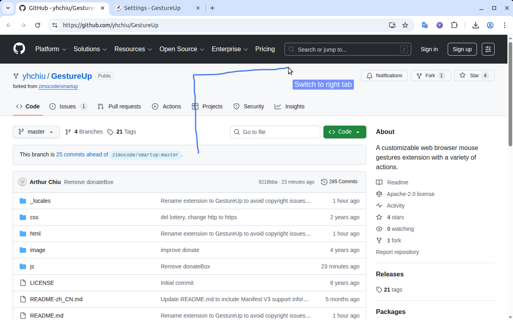
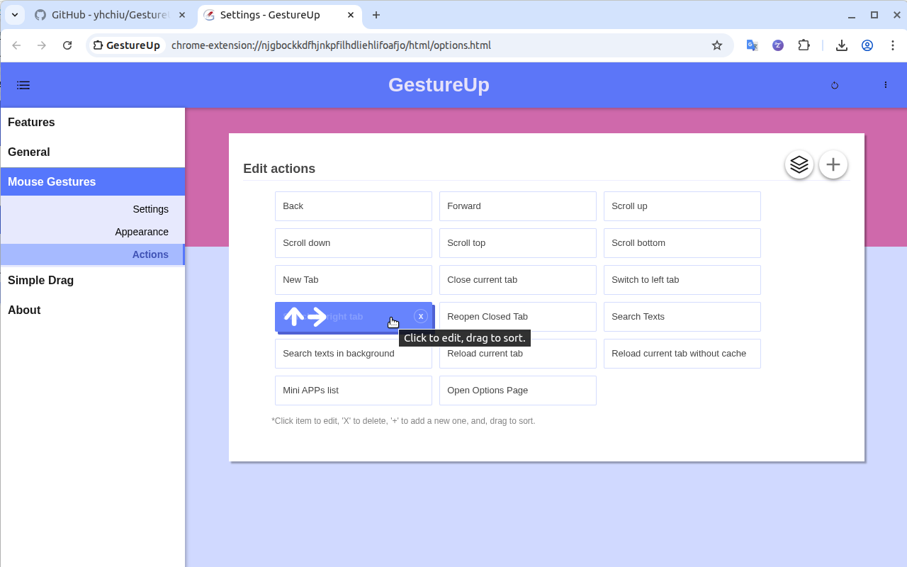
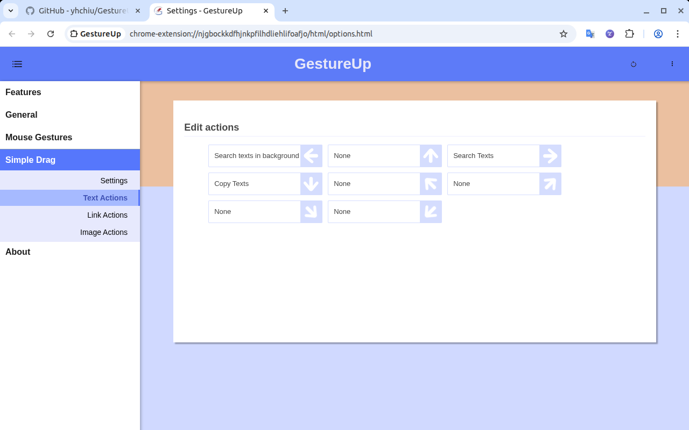
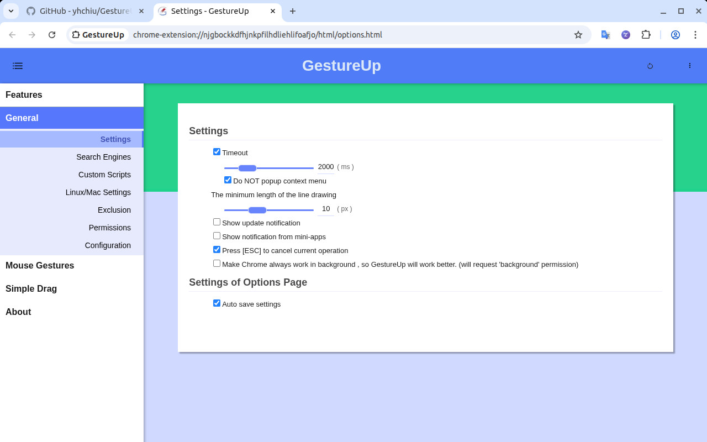
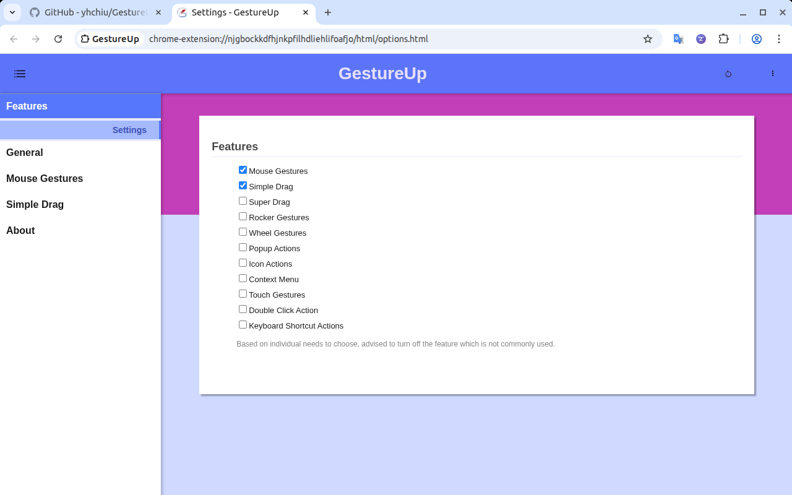

# GestureUp 

> Forked from the original [SmartUp Gestures](https://github.com/zimocode/smartup) by zimocode; updated to Manifest V3, with bug fixes and ongoing updates.

A customizable web browser mouse gestures extension with a variety of actions. Features include: mouse gestures, simple drag, super drag, rocker gestures, wheel gestures,Popup Actions, Icon Actions, Context Menu actions, Touch Gestures, Double Click Action and Keyboard Shortcut Actions.

[Available in the Chrome Web Store](https://chromewebstore.google.com/detail/gestureup/cfmbhdicpeegdoedibhmmlbhonjelamb)

## Screenshots

### Mouse Gestures

### Edit Mouse Actions

### Edit Text Actions

### Settings

### Features

## Install

### Install from Chrome Web Store (Recommended)

Install directly from the Chrome Web Store: [GestureUp](https://chromewebstore.google.com/detail/gestureup/cfmbhdicpeegdoedibhmmlbhonjelamb)

1. Visit the Chrome Web Store link above
2. Click "Add to Chrome" button
3. Confirm the installation when prompted

### Install from source

1. Download the source code from this repository
2. Open your browser's extension management page
3. Enable "Developer mode"
4. Click "Load unpacked extension" and select the downloaded folder
5. The extension will be installed and ready to use

## License

